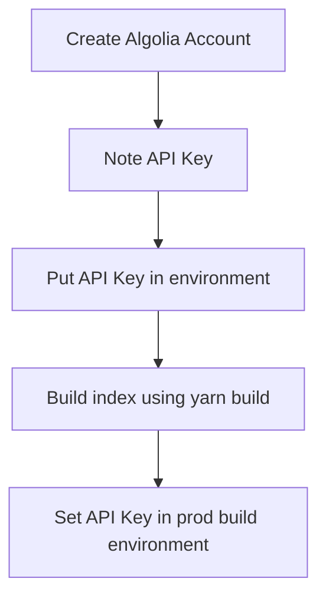

# Algolia

[Algolia](https://algolia.com) is a search indexing service.
This blog theme provides integration with Algolia.

# Workflow

These are the general workflow.
See [Adding search with Algolia](https://www.gatsbyjs.com/docs/adding-search-with-algolia/



## Local setup

Create the following entries in your `.env` file

```.env
GATSBY_ALGOLIA_APP_ID=
GATSBY_ALGOLIA_SEARCH_KEY=
GATSBY_ALGOLIA_WRITE_KEY=
```

Fill in the value from Algolia API key page

```shell
# run this to trigger index rebuild
yarn clean-build
```

## Prod deployment (Netlify)

Attach build environment for the following env (similar with local setup)

```.env
GATSBY_ALGOLIA_APP_ID=
GATSBY_ALGOLIA_SEARCH_KEY=
GATSBY_ALGOLIA_WRITE_KEY=
```
