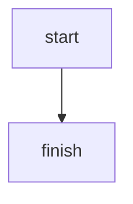

# Mermaid

This blog theme supports [Mermaid JS](https://mermaid.js.org)
using the following invocation/integration.

## Client side render

### HTML `pre` tag

A `pre` tag with a class `mermaid` will have its content processed by mermaid.

However, do note that the file format is MDX (MarkdownJSX), so things to note:

1. Set the `class` attribute using `className` (JSX)
2. Preserve mermaid code formatting (indent) by using JSX `{}` syntax.

See the MDX code below

```mdx
<pre className='mermaid'>
	{`graph TD 
    A[Client] --> B[Load Balancer] 
    B --> C[Server1] 
    B --> D[Server2]
`}
</pre>
```

Will transform into:

<pre className='mermaid'>
	{`graph TD 
    A[Client] --> B[Load Balancer] 
    B --> C[Server1] 
    B --> D[Server2]
`}
</pre>

### `Mermaid` React component

A specific `Mermaid` component exists to semantically encapsulate
mermaid code you want to render.

Again, note that the children indentation/spacing should be preserved using
JSX `{}` expression.

```mdx
<Mermaid>
	{`
graph TD 
    A[Client] --> B[Load Balancer] 
    B --> C[Server1] 
    B --> D[Server2]
`}
</Mermaid>
```

### `Codeblock` markdown

You can also render mermaid using code block.
However, add meta attribute `render`, to let the parser know
that we should render it into mermaid SVG

The following markdown code:

````markdown

````

Will render into this:


## Supported Mermaid syntax

Too see or experiment with the Mermaid syntax, see: [Mermaid Intro](https://mermaid.js.org/intro/)
