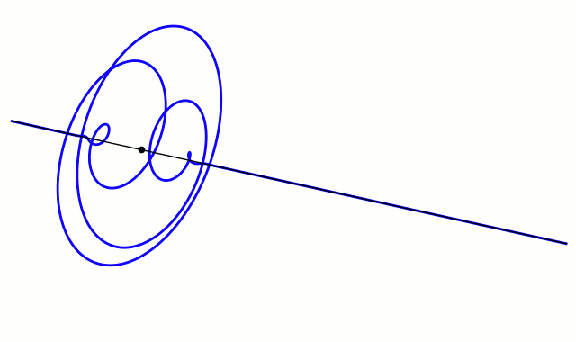

You can put your content inside a folder along with several other files.
It will be rendered/rerouted as if the slug came from a single file instead of folder.

The concept is similar like python package or go package

## Importing MDX component in the same directory

Simply import it with the extension `.mdx`, just like you would inside MDX content.

```mdx
import Component from './component.mdx'

<Component />
```

Will output the content of the component

<blockquote>

import Component from './component.mdx'

<Component />

</blockquote>

## Importing images in the same directory

Include the image location like this

```mdx

```


